# Provenance Guard

Provenance Guard is a system for classifying submitted text as likely AI-generated, likely human-written, or uncertain. The system combines an LLM classifier with stylometric heuristics, produces a confidence score, displays a transparency label, logs submission events, and supports appeal intake.

## Demo Video
- https://www.loom.com/share/22ca16934fb64bddb8e4f8172d60ef10

## Architecture Overview

The path a submission takes through the system:

```text
POST /submit
  -> apply creator_id rate limit
  -> validate text and creator_id
  -> run LLM classifier signal
  -> run stylometric heuristics signal
  -> combine signal scores into confidence score
  -> map confidence score to transparency label
  -> save submission state
  -> write audit log entry
  -> return JSON response
```

### Submission Flow

```mermaid
flowchart LR
    A[POST /submit endpoint]
    A -->|creator_id from request JSON| R[Rate limiter: 10 submissions per minute]
    R -->|raw text and creator_id| V[Request validation]
    V -->|raw text| B[Signal 1: LLM classifier]
    V -->|raw text| C[Signal 2: Stylometric heuristics]
    B -->|LLM AI-likelihood score| D[Confidence scoring]
    C -->|Stylometric AI-likelihood score| D
    D -->|Combined confidence score| E[Transparency label generator]
    E -->|Attribution and exact label text| S[Submission storage]
    D -->|LLM score, stylometric score, and confidence score| S
    E -->|Transparency label text| F[Audit log]
    D -->|LLM score, stylometric score, and confidence score| F
    S -->|Saved content ID and current status| G[API response]
    F -->|Logged submission event| G
    G -->|JSON response with content ID, scores, confidence, attribution, and label text| H[Client]
```



### Appeal Flow


Implementation notes:

- The implementation adds a `creator_id` rate-limit step before validation on `/submit`.
- The implementation adds a JSON-backed submission storage so appeals can update the current submission status to `under_review`.
- The original planning diagram showed the audit log before the API response. In implementation, the submission is saved, the audit log is written, and then the API response is returned.

## Detection Signals

### Signal 1: LLM Classifier

What it measures:

- The LLM classifier measures the meaning and context of the submitted text.
- It checks whether the writing feels specific, meaningful, and contextually grounded, or whether it just makes generic claims and has neutral tones that are common in AI-generated text.

Why I chose it:

- I chose this signal because some AI-generated writing is easier to identify through meaning-level patterns than surface-level structure alone.
- The LLM classifier can evaluate whether the text feels generic, overly neutral, or disconnected from specific human context.

What it misses:

- It may struggle with short submissions because there may not be enough content to judge whether the writing is genuinely specific or generic.
- It may also struggle with informal AI-generated text that is prompted to imitate human slang or casual writing.

### Signal 2: Stylometric Heuristics

What it measures:

- Sentence length variation: lower variation is treated as more AI-like, while higher variation is treated as more human-like.
- Type-token ratio: lower TTR can suggest repetitive/simple vocabulary, while unusually high TTR in short polished text can also be suspicious. Mid-range TTR is treated as less suspicious because it suggests more ordinary vocabulary variety.
- Punctuation density: lower density is treated as more human-like, especially in informal text, while higher density can be more AI-like because polished/generated text may use punctuation more consistently.
- These raw measurements are normalized into sub-scores and combined into one stylometric AI-likelihood score from 0 to 1.

Why I chose it:

- I chose stylometric heuristics because they provide a structural signal that is different from the LLM classifier.
- They help the system look at measurable writing patterns such as sentence length, vocabulary variety, and punctuation usage.

What it misses:

- Stylometric heuristics are weaker on short text because there are fewer sentences and words to measure.
- They may misclassify simple human writing, children's stories, or non-native English writing because those texts may use short sentences, simple vocabulary, and repeated structures.
- They may also miss AI-generated text that is prompted to be informal or uneven, because that can reduce the uniform structure the heuristics are looking for.

## Confidence Scoring

The system combines the two signal scores into one confidence score.

Current formula:

```text
confidence = (0.7 * llm_classifier_score) + (0.3 * stylometric_heuristics_score)
```

Explain why this weighting was chosen:

- I originally planned to average the LLM classifier and stylometric heuristic scores equally, but testing showed that LLM classifier was often correct while stylometric was very mixed in results.
- When I judge if text is AI-generated or not, I usually judge it semantically and holistically, similar to how the LLM would rather than looking at mainly the structure of the text.
- The LLM classifier is weighted higher because it evaluates meaning-level evidence such as generic claims, neutral tone, lack of specific context, and AI-like phrasing.
- The stylometric signal is still included, but it is weighted lower because sentence length, vocabulary variety, and punctuation can vary heavily depending on text length, genre, and author style. It's kept as supporting evidence to the LLM classifier.

Explain how I validated that the score was meaningful:

- I tested the system on four example submissions provided in the project write up: clearly AI-generated text, clearly human-written text, formal borderline writing, and lightly edited AI-style writing.
- The clearly AI-generated example scored high enough to receive a `likely_ai` attribution, while the informal human-written example scored low enough to receive a `likely_human` attribution.
- The two borderline examples produced middle-range confidence scores and were labeled `uncertain`, which matched the goal of avoiding overconfident labels when the signals were mixed.

### Example: High-Confidence Result

Submission summary:

```text
Artificial intelligence represents a transformative paradigm shift in modern society. 
It is important to note that while the benefits of AI are numerous, it is equally 
essential to consider the ethical implications. Furthermore, stakeholders across 
various sectors must collaborate to ensure responsible deployment.
```

Actual scores:

```text
LLM classifier: 0.8
Stylometric heuristics: 0.503
Final confidence: 0.711
Attribution: Likely AI
```

Why this result makes sense:

- I'm seeing generic claims that don't get elaborated on nor have any kind of human connection. If there was personal experience that connected with what the text claimed, it would be more believable as human-written. I had trouble actually understanding what the main topic is too because of the fact they're just generic claims that are semi-related to AI.

### Example: Lower-Confidence Result

Submission summary:

```text
ok so i finally tried that new ramen place downtown and honestly? 
underwhelming. the broth was fine but they put WAY too much sodium in it and 
i was thirsty for like three hours after. my friend got the spicy version and 
said it was better. probably won't go back unless someone drags me there
```

Actual scores:

```text
LLM classifier: 0.2
Stylometric heuristics: 0.3
Final confidence: 0.23
Attribution: Likely Human
```

Why this result makes sense:

- This actually feels like how humans would write informally and expressing a person viewpoint or experience to someone else online. Disregarding the fact that it doesn't follow proper gramatical structure (which is already a possible hint), the personal connection feels genuine and does relate to the main topic.

## Transparency Labels

The system maps confidence scores to the three user-facing transparency labels defined in `planning.md`.

### High-Confidence AI

Threshold:

```text
0.70 - 1.00
```

Exact label text:

```text
This submission appears likely to be AI-generated based on multiple writing signals.
```

### High-Confidence Human

Threshold:

```text
0.00 - 0.30
```

Exact label text:

```text
This submission appears likely to be written by a human based on multiple writing signals.
```

### Uncertain

Threshold:

```text
0.31 - 0.69
```

Exact label text:

```text
The system found mixed signals in the writing, making it hard to label and it cannot confidently determine if this submission was written by a human or AI-generated.
```

## Rate Limiting

Chosen limit:

```text
POST /submit: 10 submissions per minute per creator_id
```

Reasoning:

- I chose 10 submissions per minute because a person is unlikely to manually submit more than that while copying text, waiting for the result, reading the label, and deciding whether to submit again. If they somehow do get to that limit, they can wait until the next minute which is still soon.
- This limit still allows quick testing and normal use, but it slows down simple scripts that repeatedly submit text through the endpoint.
- The limit is keyed by `creator_id` because this prototype does not include authentication or IP-based tracking.

What this prevents:

- It prevents one `creator_id` from rapidly flooding the `/submit` endpoint with many classification requests in a short period.
- It reduces accidental overuse during testing and helps protect the LLM-backed classifier from simple automated loops. LLM calls can cost money or have a maximum call amount per day, so it's important to rate limit this.

What this does not prevent:

- It does not stop someone from rotating or faking different `creator_id` values.
- In a production system, this would be replaced or supplemented with rate limiting based on authenticated account identity, IP address, or both.

## Known Limitations

Specific content type the system may misclassify:

- A short, simple forum comment that follows grammatical rules.
- A children's book or children's story.
- An AI-generated comment prompted to sound informal or use popular slang.

Why the system may misclassify it:

- Short comments may not provide enough context for the LLM classifier, and there may be too few sentences for reliable stylometric measurements.
- Children's stories often use short sentences, simple vocabulary, repeated structure, and clear punctuation, which can look AI-like to the stylometric signal.
- Informal AI-generated text may intentionally avoid uniform structure, making it look more human-like to the stylometric signal.
- Even the stylometric heuristic calculations were having trouble when scoring on its own, which lead to me weighing it less than the LLM classifier in final confidence calculations.

How the current design tries to reduce harm:

- The system combines two different signals instead of relying only on one detector.
- The transparency labels include an uncertain category for mixed or borderline results.
- There is only two 30% windows (0.0 - 0.3 and 0.7 - 1.00) where the system will confidently say it is likely AI or human. This window size seemed like an appropriate size to maintain a balance between correctly classifying and reducing false positives with high confidence. 
- The appeal endpoint lets a creator ask for review when they believe a classification is wrong.

## Spec Reflection

One way the spec helped me:

- The spec really helped provide a baseline of where to start. It helped me break down this project into an actionable plan of milestones and components to build, which was very useful given its a project I've never have done before (specifically the combination of LLM classifier and stylometric heuristics). Even when there was uncertainty, it helped provide that initial starting point to build and then iterate/improve on while building.

One way implementation diverged from the spec and why:

- As stated earlier, I had weighed both signal detection equally when calculating the final confidence score. When testing, it was quite frustrating how all of the example texts were all labeled as "uncertain". After further investigation, it was mainly the LLM classifier that was properly classifying with the stylometric heuristics having trouble and dragging the scores into the "uncertainty" threshold range when averaging. I analyzed how I normally would judge text for AI usage and it was similar to how the LLM classifier would (semantically, the meaning or depth, and just holistically), so I decided to weigh the LLM classifier more in the final calculation.

## AI Usage

### Instance 1

What I directed the AI to do:

- For my first signal, I directed the AI to create a component that uses LLM classification for text, judging it on semantics, meaning, context, and overall holistically if the text was AI-generated or human-written. It created ``llm_classifier.py`` component which would return a JSON with information on the score and also extra details like "status" ("completed", "error") and "model" (llama-3.3-70b-versatile).

What I revised or overrode:

- I don't think the "status" and "model" fields were necessary for the project. Maybe they would be useful to have if this is used in production, but I simply didn't need these extra information when making this system to judge submitted text. I removed the "status" and "model" fields and still handled errors by having it return "None" in the "score" field.

### Instance 2

What I directed the AI to do:

- For my second signal, I directed the AI to use stylometric heuristics, specifically on sentence length variance, type-token ratio, and punctuation density. It created the ``stylometric_heuristics.py`` component to calculate this signal to analyze the text structure, normalizing the calculations to subscores in the range of 0 - 1 to average into one score for stylometric heuristics.

What I revised or overrode:

- One thing that I noticed with the stylometric heuristics was that punctuation density was affecting the final stylometric score and as a result affecting the final confidence score, making the classifications incorrect when testing. It was making the final confidence scores of AI text lean towards uncertain and human-like. I think punctuation density isn't a big factor in judging AI-generated text, so I decided to reduce the weight on it compared to the other two statistics.

