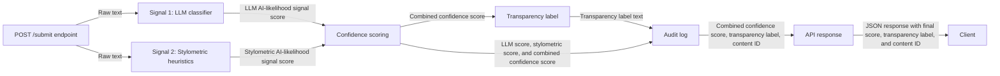
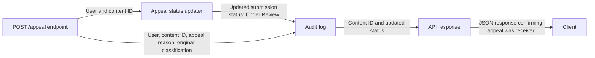

# ProvenanceGuard Planning

## Detection Signals

### Signal 1: LLM Classifier

#### What does this signal measure?
- Measures the meaning and context of the text, checking if the text is feels specific or meaningful and contextually grounded rather than generic claims or neutral tones which are common in AI-generated text.

#### What does this signal's output look like?
- Returns an "AI likelihood" score from 0 to 1.

### Signal 2: Stylometric Heuristics

#### What does this signal measure?
- Measures the structural properties of the text such as sentence length variance, type-token ratio, and punctuation density. AI generated text is usually more uniformly structured and less varied/flexible as how humans would write.
- Sentence length variance:
    - Lower variance -> more AI-like
    - Higher variance -> more human-like
- Type-Token Ratio
    - Lower TTR -> more repetitive/simple vocabulary -> more AI-like
    - Higher TTR -> more varied vocabulary -> more human-like
- Punctuation Density
    - Lower density -> more human-like, especially in informal text
    - Higher density -> more AI-like because they use more punctuation to follow proper grammatical correctness

- These calculations will be normalized to average into one combined output score for "AI likelihood" for the signal.

#### What does this signal's output look like?
- Returns an "AI likelihood" score from 0 to 1.

### Signal Combination Method

- I will average the two signals together into one final confidence score for AI likelihood.
    - final_ai_score = (llm_ai_score + stylometric_ai_score) / 2
- Since there are only two signals, majority vote using binary flag signal outputs wouldn't make sense as there can be ties in decision-making with no other signal to break the tie.
- There isn't a fine-tuned weighted average because I have no prior observable data to accurately tune the detection signals to. As a baseline decision, both signals are weighted the same for this project. 

## Uncertainty Representation

### What does a confidence score mean in this system?
- Confidence score will represent how confident my system is that the text is AI. The score is a spectrum from human-like to AI-like, with the lowest scores meaning more confidence the text is written by a human while the highest scores meaning more confidence the text is written by AI.
### What does a score of 0.6 mean?
- A score of 0.6 would mean the system is leaning towards AI classification for the text, but it isn't fully confident in it given that it's close to the middle ground of the binary decision. Given that the project write-up has three labels to use (high-confidence AI, high-confidence Human, and uncertain), this would map towards more "uncertain" than "high-confidence AI".
### How will raw signal outputs be mapped to a confidence score?
- The LLM classifier should already return an AI-likelihood score in the range of 0-1 that should be ready for confidence score calculations.
- Stylometric heuristics:
    - Raw measurements will be calculated (sentence length variance, type-token ratio, punctuation density)
    - Raw measures are using different scales, so they each need to be normalized into a 0-1 AI-likeliness scale for sub-scores.
    - The normalized sub-scores will be averaged to get the signal output for stylometric heuristics
- Final confidence score is averaged between the two signal outputs, with no specific weighting given that I don't have previous experience on which should be weighted/biased more.
### Thresholds

- "Likely AI" or "High-confidence AI": 0.70 - 1.00 
- "Likely Human" or "High-confidence Human": 0.00 - 0.30
- "Uncertain": 0.31 - 0.69

## Transparency Label Design

### High-Confidence AI Label
- This submission appears likely to be AI-generated based on multiple writing signals.

### High-Confidence Human Label

- This submission appears likely to be written by a human based on multiple writing signals.

### Uncertain Label

- The system found mixed signals in the writing, making it hard to label and it cannot confidently determine if this submission was written by a human or AI-generated.

## Appeals Workflow

### Who can submit an appeal?
- Only the creatores of the original text submission can appeal for that text submission.

### What information does the appeal form collect?
- The appeal form must collect:
    - User
    - Original classification
    - Reasoning for appeal

### What happens when an appeal is received?
- The appeal must be logged from information provided in the form

### What status changes occur?
- The content that was appealed will be set with a status of "Under Review"

### What gets written to the audit log for appeals?
- Who submitted appeal
- The original classification
- The reasoning for appeal

### What does a human reviewer see in the appeal queue?
- Key/ID to the actual content
- Original classification
- Reason for appeal
- Status

## Anticipated Edge Cases

### Edge Case 1

Scenario: A short, simple comment on a forum post that follows grammatical rules.

Why the system may handle it poorly:
- There's a lot of variance of how people write online and some decide to follow grammatical rules while some do not since the context is very informal.
- A simple 2-4 sentence comment on a forum that can have generic or non-meaningful content given its short length, and may fail the LLM classifier.
- It can also fail from a stylometric heuristics POV because there's less sentences to calculate variance from and the vocabulary may also be simple.

### Edge Case 2

Scenario: Children's book/story

Why the system may handle it poorly:
- Children's books and stories are meant to be simple for children to learn how to read and be able to understand what is being written
- Often uses shorter sentences, simple vocabulary and possible low type-token ratio, and clear/correct punctuation usage.

### Edge Case 3:

Scenario: AI comment, but with instructions to be informal or add popular slang

Why the system may handle it poorly:
- In an informal context and an attempt to imitate humans, the text might not follow a uniform structure that stylometric heuristics calculates on and could depend on whether or not the LLM can properly classify it as AI text. 

## Architecture
- When a user submits text content, the /submit endpoint will send the content into the multi-signal detection pipeline (LLM classifier and Stylometric Heuristics) to get a confidence score and classification label. The results will then be logged and also be sent back to the user.
- When a user submits an appeal, the /appeal endpoint will send the user metadata and content ID into an appeal status updater to update the status of the submission to be "Under Review", which gets written to the audit log. The endpoint will also send the user meta data, content ID, appeal reason, and original classification of the content to the log the appeal. At the end, the API will return back a JSON of the content ID and updated status to confirm the appeal has gone through.

- Submission flow

- Appeal flow

## AI Tool Plan

### M3 (submission endpoint + first signal)
- I will provide my AI agent the ``planning.md``, specifically the architecture diagram of the submission flow and the LLM classifier detection signal section to have it create an endpoint that accepts raw text for classification. The LLM classifier component will use Groq's llama-3.3-70b-versatile and create a system prompt that will be used for the LLM to classify if the text was written by a human or AI, providing a score on the scale of 0-1, where 0 is more likely to be human and 1 to be more likely to be AI.

### M4 (second signal + confidence scoring)
- I will provide my AI agent the ``planning.md``, specifically the architecture diagram of the submission flow, the stylometric heuristics detection signal section, signal combination section for the confidence score, and uncertainty representation section to create a component that does the stylometric heuristics calculations and combined confidence scoring components. The stylometric heuristics components will calculate and scale calculations of sentence length variance, type-token ratio, and punctuation density into an AI-likelihood score like the LLM classifier. The confidence score will be calculated from averaging the two detection signal scores.

### M5 (production layer)
- I will provide my AI agent the ``planning.md``, specifically the architecture diagrams for the submission flow, transparent label section, and threshold sections to determine the classification using the combined confidence scoring and described thresholds. I will also provide the appeals workflow section and the architecture diagram to build the appeal endpoint that can update the status and log the appeal.